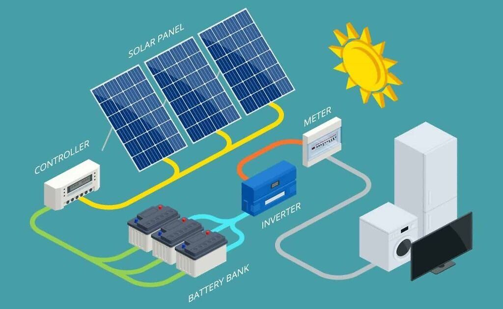

# Objectives

First of all it is important to know what is a PV or photovoltaic system. A photovoltaic system is a special electrical system that produces energy from a renewable and inexhaustible source - the sun, in other words it is a solar panel. Image below demostrates an operating principle of a complete system.  



The main business objectives of project are to get visualization, analysis and prediction of the trends in solar panel system prices and sizes (the total rated direct-current (DC) output of the module arrays at standard test conditions.) throughout the time series for both consumer and business customers, to identify what can influence pricing and sizing, to get data insights, relations, dependicies, to forecast and predict future pricing and size of installations. Thus providing assistance to the energy companies, installers, and other stakeholders in understanding the current and potential future market dynamics of solar panel installations. Also it will be possible to identify how PV systems have developed throughout the years, maybe it will be the most effective energy source in the future, who knows.

## Current situation
A the starting point we have a dataset containing 1000000 rows of data and 78 columns. Missing data are coded in the database as -9999. The main variables to point out are (explanations are taken from supporting pdf file for this dataset):  
1.  **System size**  
The total rated direct-current (DC) output of the module arrays at standard test conditions. These data are generally reported directly by the data provider, but in some cases must be estimated, for example, based on the module model and quantity or based on reported alternating-current (AC) capacity.  
2.  **Total installed price**  
The total installed price for the PV system, prior to receipt of any incentives, as reported by the installer, host customer, or other incentive applicant. For third-party owned systems, the data may represent one of two things. If the third-party owner procured the system from an independent installation contractor, then the reported installed price likely refers to the intermediate sale price between the installation contractor and the third-party owner. If the third-party owner instead installed the system itself, then the reported installed price likely represents an appraised value.  
3.  **Rebate or grants applied**  
The pre-tax value of any up-front rebate or grant provided by the entity supplying the data. It can affect the installation price indirectly, while total installed price remains the same, a rebate reduces the net cost for the customer. This can make solar panel systems more affordable and attractive.  
4.  **Geo Data**   
Data about coordinates, ZIP codes, cities etc.  
4.  **Customer segments**  
Data on customer segment is mapped to one of six general types: RES, COM, SCHOOL, GOV, NON-PROFIT, and NON-RES.  
5.  **Installation dates**  
For some data providers, the installation date may be based on the best available proxy, such as the date that an incentive claim was submitted or when the inspection was performed.  
6.  **Columns describing PV installation compontents (modules, inverters, meters, etc.).**
7.  **Columns about battery (energy storage device) if such is installed.**  
  
**Part of insights from data-report from phase 2**

During the initial Data Analysis it was discovered that the system_ID_1 is the unique identifier for the installation, which can be used to join or fuse any other available datasets. Valid data also contains significant amount of outliers, so dropping them would shrink the dataset completely, also clipping might significantly damage already not perfect data quality, so it is decided to leave them. According to the analysis there is around 160000 missing "total_installed_price" values in years 2013-2015. Also from NaN correlation matrix it is seen that missing values especially from columns "city", "system_ID_1", "additional_modules", "additional_inverters", "DC_optimizer", "inverter_qantity_1", "micro_inverter_1" correlate with missing values in other columns. It was also identified that columns containing word "model" or "manufacturer" have quite big amount of unique values, describing the installation in more detail. There are also columns containing only two unique values 0 or 1, which correspond for a ceratin feature of PV module, like is it ground mounted, is it tracking the sun or is there additional modules or not etc. There are also numerical variables such as system_size_DC, output_capacity_inverter_1, nameplate_capacity_module, and module_quantity describing generative electricity power of the PV installation. Also noticable column is rebate_or_grant it shows an amount of long term "discount" provided to the customer by certain authority. In gerenal data quality is quite bad. Many categorical columns (model, manufacturer, etc.) have high cardinality, which can affect modeling.  

**Below is the list of variables having more or less decent amount of valid content**
| Variable                        | Valid percent|
|:--------------------------------|---------:|
| installation_date               | 100      |
| utility_service_territory       | 100      |
| state                           | 100      |
| customer_segment                | 100      |
| expansion_system                | 100      |
| multiple_phase_system           | 100      |
| city                            |  99.9999 |
| system_ID_1                     |  99.9895 |
| additional_modules              |  99.8971 |
| additional_inverters            |  99.8971 |
| module_quantity_1               |  99.6328 |
| DC_optimizer                    |  99.502  |
| inverter_quantity_1             |  99.4951 |
| micro_inverter_1                |  99.4201 |
| system_size_DC                  |  98.8692 |
| self_installed                  |  95.5557 |
| rebate_or_grant                 |  95.4632 |
| bifacial_module_1               |  94.7354 |
| technology_module_1             |  94.3796 |
| BIPV_module_1                   |  94.0045 |
| installer_name                  |  93.1942 |
| third_party_owned               |  91.7377 |
| nameplate_capacity_module_1     |  90.6207 |
| efficiency_module_1             |  90.5703 |
| module_manufacturer_1           |  90.1152 |
| module_model_1                  |  90.1115 |
| built_in_meter_inverter_1       |  90.0303 |
| tracking                        |  89.944  |
| inverter_manufacturer_1         |  88.8617 |
| output_capacity_inverter_1      |  82.949  |
| solar_storage_hybrid_inverter_1 |  81.7208 |
| total_installed_price           |  81.4364 |
| ground_mounted                  |  75.9462 |
| inverter_loading_ratio          |  75.3185 |

It is important to mention that there is an alternative data source available and it is mentioned in documentation to the dataset which was provided for this project. It will be used for fusion in the phase 3. 
```
Version Date: August 21, 2024.
Download instructions:
The data file can be downloaded in CSV format here: https://bit.ly/trackingthesun-2024. Changes may be
made to the data file so please check the site regularly to download the latest version. If there are any
difficulties downloading or opening the file, please email Naïm Darghouth (ndarghouth@lbl.gov)
```
## Initial goals of data analysis

1.  Data cleaning and preprocessing, outlier detection, descriptive statistics, time series visualization.
2.  Understanding the relationships between system price, system size, and customer segment over time, additionally can be evaluated dependency of price over installation components.
3.  Checking for the trends and changes in prices and system sizes, per customer group and for price in general.
4.  Identification of patterns of price change during the different quarters/periods/seasons of the year.
5.  Checking the impact of the rebates and grants on installation total price and size.

**Tools:** Matplotlib, Seaborn, Pandas, numpy  
**Methods:** Boxplots, histplots, barplots, pair plots, regplots, f-scoring, chi2, ewm, rolling window.

## Initial goals of modelling

1.  Analyze need for potenial feature engineering? 
2.  To use time series to predict future price and system size trends.
4.  To build regressive models that can predict system price based on system size, customer segment, installation date, and amount of rebates
5.  Build model capable of prediction of price based on features mentioned in point above and in addition to them installation component data  

Also it is needed to interpret modeling results, feature importances, and sensitivity, and compare algorithmic models with deep learning models.

**Tools:** sklearn, tensorflow, numpy, skforecast  
**Methods:** We will try different regression models starting with baseline models such as ElasticNet, Gradient Boosting, Decision tree regressor, we will definitely try to use ARIMA, and in addition deep learning including RNNs, such as LSTM, biLSTM, GRU. Deep learning is very good to consider for final model which will utilize also installation component features with high cardinality.

## Project's goals

1.  Get insights into how prices and system sizes of solar panel installations have evolved over time for both different customer groups and in total.
2.  Examine the relationship between customer group, system size, price, rebates
3.  Examine the relationshop between components and pricing
3.  Develop predictive models that can forecast future prices and system sizes based on time series for different customer groups and in general
4.  Ultimate goal is to develop more robust model capabale of price forecating considering features above and additionally system components, that will provide an huge value for the stakeholders, since they will be able to plan their investments and it can assist in strategical decision making process for the business.  

I won't consider following things but it can be a potential for the imporvement:  
* Inflation and economic conditions
* Raw material prices
* Technological advancements in solar panels and batteries
* Policy changes and government incentives  

Accuracy of the results can be measured using such metrics as MSE, MAE, MAPE, RMSE, r-squared and explained variance.

## Project timeline

1. Business Understanding (Week 1)
2. Data Understanding (Week 1)  
    EDA
3. Data Preparation (Week 2)  
    Cleaning the data, filling, dropping NaNs, fusing the data
4. Modeling (Week 3)  
    Feature engineering + modelling
5. Evaluation (Week 3-4)
6. Deployment (Week 5)

## Resources

Decent computer, 1 person and brain.


